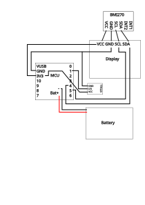

# ink

MCU-based digital inclinometer

> Note: Information as of October 2026

## Repository structure

```shell
├── 3mf
│   ├── back.3mf // back cover for the enclosure
│   ├── body.3mf // enclosure body
│   ├── gyro-support.3mf // support that goes between the display and the gyroscope
│   ├── mcu-support1.3mf // support for the enclosure rigidity pt. 1
│   ├── mcu-support2.3mf // support for the enclosure rigidity pt. 2
├── LICENSE
├── README.md
├── ink
│   └── ink.ino // Arduino firmware code
└── ink.FCStd // FreeCAD model of the enclosure
```

## Hardware

### Parts list

| Name | Price |
|:----:|:-----------:|
| [Seeed nRF52840 MCU](https://www.seeedstudio.com/Seeed-XIAO-BLE-nRF52840-p-5201.html) | 9 € |
| [BMI270 Gyroscope and Accelerometer](https://www.laskakit.cz/laskakit-bmi270-6-osy-gyroskop-a-akcelerometr/) | 11 € |
| [OLED Display](https://www.laskakit.cz/laskakit-oled-displej-128x64-1-3--i2c/?variantId=11903) | 7 € |
| [LiPol Battery](https://www.laskakit.cz/baterie-li-po-3-7v-500mah-lipo/) | 4 € |
| [Battery Connector](https://www.laskakit.cz/jst-ph-2mm-smd-konektor-do-dps--pravouhly/?variantId=7224) | 0.1 € |
| [TTP223 Capacitive Sensor](https://www.laskakit.cz/arduino-kapacitni-dotykove-tlacitko-ttp223/) | 0.2 € |

### Wiring Diagram



## Software

To flash the device, find your device identifier (should look like ttyACM0):
```shell
$ ls /dev/tty*
```

Then execute the command:
```shell
arduino-cli compile --fqbn Seeeduino:nrf52:xiaonRF52840 -u -p /dev/ttyACM0 ink
```

It will compile the firmware and flash it onto your device.

